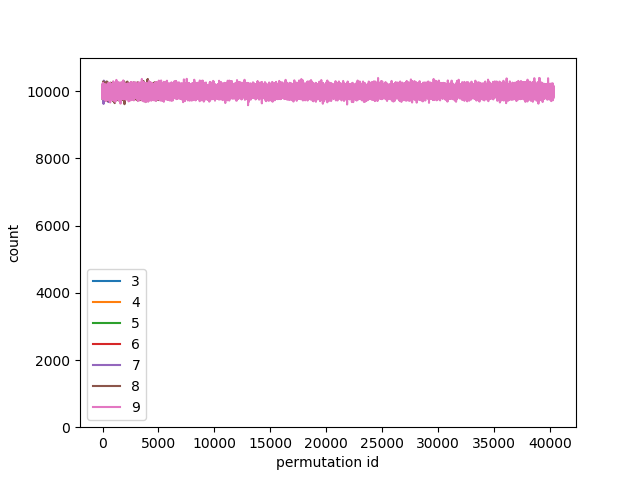

# rscpcreator

header only c++11 library for creation of random single-cycle permutations

## Usage:

Example:

    #include <rscp/creator.h>
    #include <rscp/utils.h>

    ...
    size_t N=10;

    //pass a random number generator of your test to the constructor
    rscp::creator<int> creator(N, std::mt19937(1000));

    //reserve memory for the result:
    std::vector<int> result(N);

    //create a random single-cycle permutation:
    creator.next(result);
    ....
    //create next random single-cycle permutations:
    creator.next(result);

Define `RSCP_CHECK` to validate results during the run-time, e.g.:

    #define RSCP_CHECK
    #include <rscp/creator.h>

## Algorithm

Use Fisher-Yates (https://en.wikipedia.org/wiki/Fisher%E2%80%93Yates_shuffle) for creating a random permutation P. Choose S - a single cycle permutation (in our case just shifted by 1), then

    P^{-1}SP 

is a single-cycle permutation.

#### Distribution

For n elements there are (n-1)! single-cycle permutations and every permutation is choosen with the probability of 1/(n-1)! by the presented algorithm. Run

    sh run_test.sh theo_distr 

to verify this for n=3..9.

This is due to the fact, that Fisher-Yates chooses uniformly from all possible permutations.

Run

    sh run_test.sh exp_distr 

to see the experimental distribution (you might to increase the number of elements by changing the constant `FACTOR`). The results looks pretty uniform for n=3..9:

## Tests

Run:

    sh run_test.sh build 
    sh run_test.sh theo_distr 
    sh run_test.sh exp_distr 

## TODOs

   * more convient API
   * inefficient (?) handling of std::XXX_distribution

